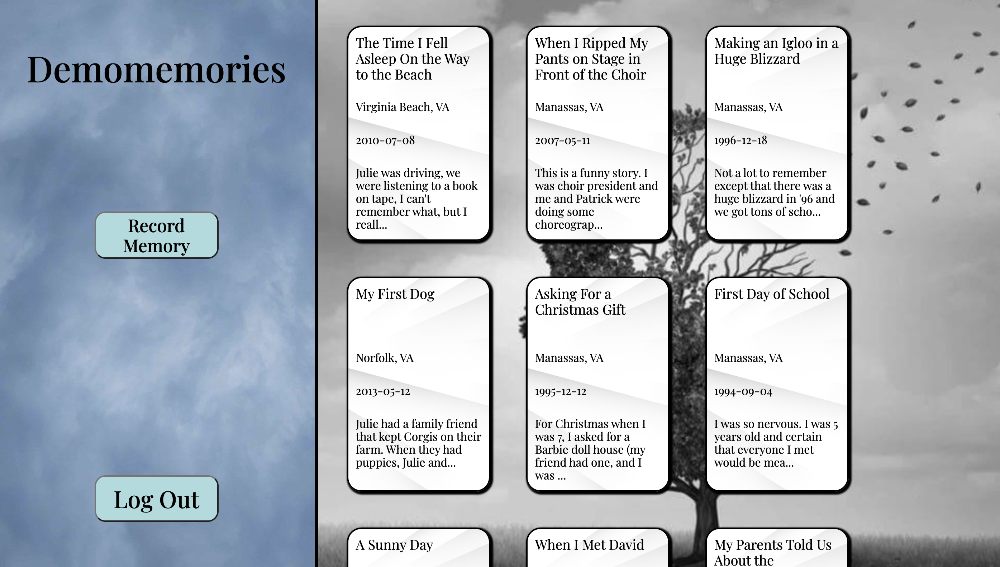
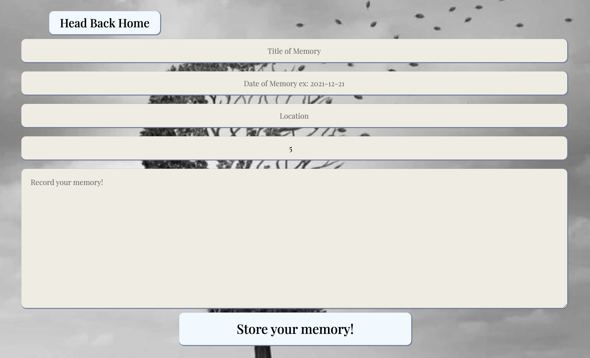
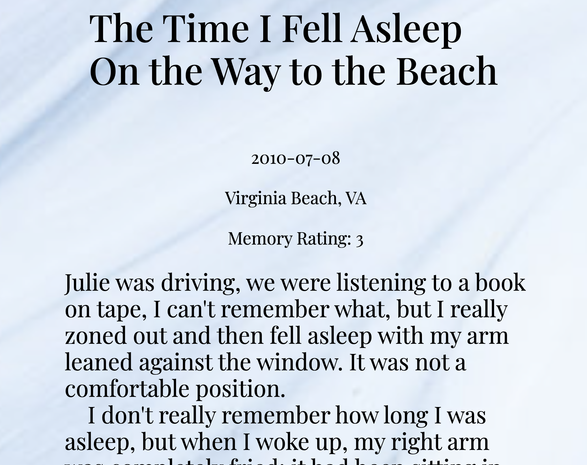

# Remembernote
- An app where a user can record their autobiography one memory at a time. 

- Deployed to Heroku: [Remembernote](remembernote.herokuapp.com)

## Technology used
- React
- Redux
- Expres
- PostgreSQL
- Sequelize

## Index
- [Schema](https://github.com/ClifDevelops/Remembernote/wiki/Database-Schema)
- [Feature List](https://github.com/ClifDevelops/Remembernote/wiki/Remembernote-Feature-List)

## Features
- A user can record a memory, giving it a title, a date, and a story. The idea here is that a user might record a backlog of memories and store their autobiography over time. 

- All of the memories are shown on a user's homepage, and each can be viewed fully.

## To-dos
- Add tags. Be able to search/sort by tags.
- Be able to add images through use of AWS.
- A brainstorm component that provides suggestions for memories to recall.
- A timeline that shows density of recorded memories at any particular date/year.